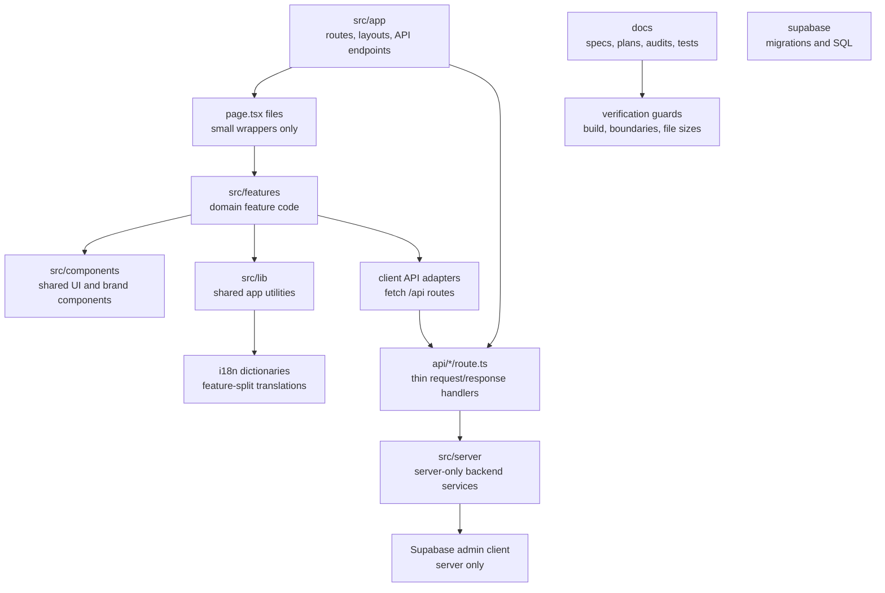

# Project Structure Diagram

This is the target structure we are moving toward. The goal is smaller files, clear ownership, and no UI or behavior changes during refactors.



## Folder Plan

```txt
src/
  app/
    page.tsx                         # public shop wrapper
    shop/[id]/page.tsx               # product detail wrapper
    admin/*/page.tsx                 # admin page wrappers
    login/page.tsx                   # auth route wrapper
    reset-password/page.tsx          # auth route wrapper
    api/*/route.ts                   # thin API route handlers

  components/
    bike-city-logo.tsx
    ui/
      alert.tsx
      badge.tsx
      button.tsx
      card.tsx
      empty-state.tsx
      form-control.tsx
      icon-button.tsx
      image-frame.tsx
      loading-indicator.tsx
      modal.tsx
      modal-actions.tsx
      stat-card.tsx
      toolbar.tsx

  features/
    admin/
      inventory/
      staff/
      reports/
      reservations/
      settings/
    auth/
      access/
    catalog/
      components/
      domain/
      dto/
      repositories/
      adapters/
        api/
        mock/
    fields/
      settings/
      domain/
      dto/
      repositories/
      adapters/
        api/
        mock/
    reports/
      domain/
      dto/
      repositories/
      adapters/
        api/
        mock/
    reservations/
      components/
      dto/
      repositories/
      adapters/
        api/
        mock/
    shop/
      public/
    shared/
      data/
      domain/
      freshness/

  server/
    catalog/
    fields/
    reservations/
    reports/
    staff/
    settings/
    shared/

  lib/
    auth/
    i18n/
      dictionaries/
    supabase/
    feature-flags.ts

docs/
  specs/
  plans/
  audits/
  tests/

supabase/
  migrations/
  sql/
```

## Ownership Rules

- `src/app` owns routing only.
- `src/features` owns domain screens, hooks, DTOs, repositories, and feature components.
- `src/components/ui` owns generic reusable UI only.
- `src/server` owns direct backend logic and Supabase admin access.
- `src/lib/i18n/dictionaries` owns translations only.
- `docs/tests` owns verification guards.

